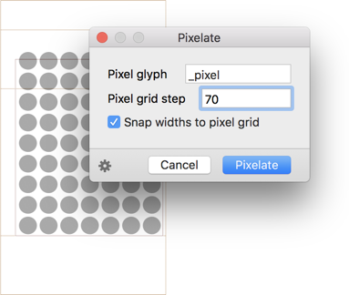

# Pixelate

[Glyphs.app](https://glyphsapp.com/) filter plug-in for rasterising shapes with a user-defined pixel glyph.

After installation, it will add the menu item *Filter > Pixelate*. You can set a keyboard shortcut in System Preferences.

### Installation

1. In Glyphs, go to *Window > Plugin Manager.*
2. Click the *Install* button next to the *Pixelate* entry.
3. Restart Glyphs.

### Usage Instructions

1. Open a glyph in Edit View, or select any number of glyphs in Font or Edit View.
2. Use *Filter > Pixelate* to insert pixels.

* **Pixel glyph:** The name of the glyph you want to insert as pixel components.
* **Pixel grid step:** The step width of the pixel raster, in units. This is the distance between component origins.
* **Snap widths to pixel grid:** Should the glyph width be rounded to the pixel grid as well?

Alternatively, you can also use it as a custom parameter. Click the gear button in the lower left corner and choose *Copy Custom Parameter* from the pop-up menu that appears, and paste it in *File > Font Info > INstances > Custom Parameters,* e.g.:

	Property: Filter
	Value: Pixelate; grid:70; component:_pixel; snapwidth:1

At the end of the parameter value, you can hang `;exclude:` or `;include:`, followed by a comma-separated list of glyph names. This will apply the filter only to the included glyphs, or the glyphs not excluded, respectively.

### Requirements

The plugin needs Glyphs 2.5.2 or higher, running on OS X 10.9 or later. I can only test it in current OS versions, and cannot guarantee its functionality in previous app and macOS versions.

### License

Copyright 2018 Rainer Erich Scheichelbauer (@mekkablue).
Based on his script of the same name and sample code by Georg Seifert (@schriftgestalt) and Jan Gerner (@yanone).

Licensed under the Apache License, Version 2.0 (the "License");
you may not use this file except in compliance with the License.
You may obtain a copy of the License at

http://www.apache.org/licenses/LICENSE-2.0

See the License file included in this repository for further details.

